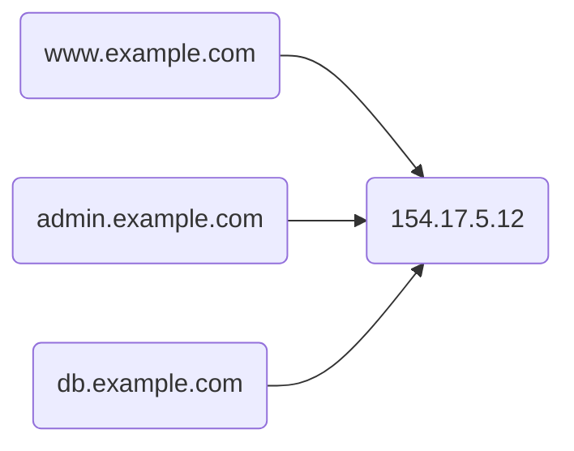
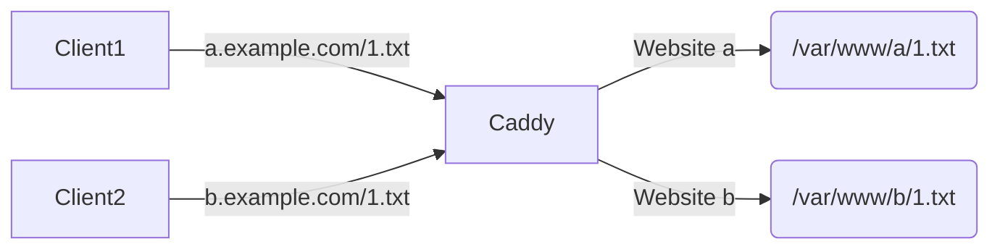
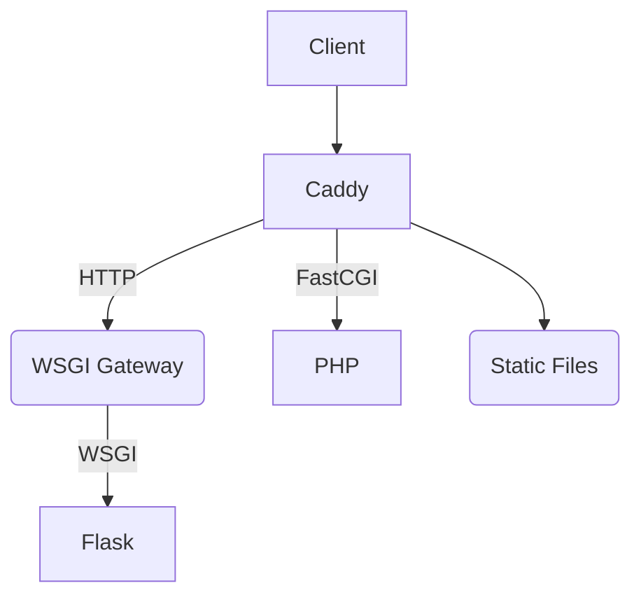

<div>
<h1>Caddy</h1>
Ultimate Server with Automatic HTTPS
</div>

---

## Why you need a web server

- Serving static files
  - Traditional HTML Pages
  - SPA Apps built with Vue / React
  - `npm run serve` is not suitable for production use!
- Reverse Proxy
  - Load-balance requests onto different instances
  - Split API / static content requests
  - HTTPS support
- Virtual Host
  - Multiple services, multiple domains
  - Same host machine

---
layout: two-cols
class: mx-1
---

## Examples

### Serving static files with httpd on Ubuntu

```sh
$ ls /var/www/html # default folder for static files
css img index.html js
```

### Virtual Host



::right::

### Reverse proxy

```nginx
upstream api_backend { server api_backend.example.com:80; }
upstream filebrowser { server filebrowser.example.com:80; }
server {
    listen 80;
    location / {
        proxy_pass http://api_backend;
        proxy_set_header X-Forwarded-For $proxy_add_x_forwarded_for;
        proxy_set_header Host $host;
        proxy_redirect off;
    }
    location /upload_media_files/ {
        proxy_pass http://filebrowser;
        proxy_set_header X-Real-IP $remote_addr;
        proxy_set_header Host $http_host;
        proxy_set_header X-Forwarded-For $proxy_add_x_forwarded_for;
        proxy_set_header Upgrade $http_upgrade;
        proxy_set_header Connection "upgrade";
    }
}
```

---

## Common Web Servers

<div>
  <div>
    <logos-apache class="inline" /><a href="https://httpd.apache.org/">Apache</a>
  </div>
  <div>
    <logos-nginx class="inline" /> <a href="https://nginx.org/en/">Nginx</a>
  </div>
  <div>
    <logos-lighttpd class="inline" /> <a href="https://www.lighttpd.net/">Lighttpd</a>
  </div>
  <div>
    <vscode-icons-file-type-caddy class="inline" /> <a href="https://caddyserver.com/">Caddy</a>
  </div>
  <div>
    <grommet-icons-golang class="inline" /> <a href="https://traefik.io/traefik/">Traefik</a>
  </div>
</div>

First 2 of them are widely used, but too hard for beginners.

### Example: using NGINX

```bash {4,5,7|9,10,11}
$ sudo apt install nginx
$ ls /etc/nginx/
conf.d                  koi-utf             scgi_params.default
default.d               koi-win             sites-available
fastcgi.conf            mime.types          sites-enabled
fastcgi.conf.default    mime.types.default  uwsgi_params
fastcgi_params          nginx.conf          uwsgi_params.default
fastcgi_params.default  scgi_params         win-utf
$ ls /etc/nginx/sites-available/ # after configuration
mapping.conf   overleaf-create-user.conf  root.conf    wp.conf
overleaf.conf  recruit.conf               static.conf
```

---

## HTTPS Support

- Crucial to privacy and safety
- In 10 years ago, you need to configure HTTPS certificates manually.
- Usually one has to pay ~$10/yr for a certificate.

## Free certificates with Let's Encrypt

- Once you've owned a domain, you can use this service to get free certificates
- However, rate limits apply, and you need to **renew** them on a regular basis
  - Otherwise, Certificate Errors! [Example of Expired Cert](https://expired.badssl.com/)
- [Certbot](https://certbot.eff.org/lets-encrypt/ubuntufocal-nginx)+NGINX or [**Caddy**](https://caddyserver.com/) both renew your certificates automatically
- Enable HTTPS with a few lines of code

```bash
$ sudo snap install --classic certbot
$ sudo ln -s /snap/bin/certbot /usr/bin/certbot
$ sudo certbot --nginx
```

---

## Get your hands dirty!

### Configure DNS Records

`www.example.com` is resolved to `93.184.216.34`. Website root is `/var/www/html/`.

### Install Caddy on your server

```bash
$ sudo apt install -y debian-keyring debian-archive-keyring apt-transport-https
$ curl -1sLf 'https://dl.cloudsmith.io/public/caddy/stable/gpg.key' | sudo apt-key add -
$ curl -1sLf 'https://dl.cloudsmith.io/public/caddy/stable/debian.deb.txt' | sudo tee /etc/apt/sources.list.d/caddy-stable.list
$ sudo apt update
$ sudo apt install caddy
```

### Configuration

copy-paste the following lines into `/etc/caddy/Caddyfile`:
```
www.example.com
root /var/www/html/
file_server
```

### Restart Caddy

```bash
$ sudo systemctl restart caddy # Now you've got a fully-featured HTTPS server!
```

---

## Virtual Hosts

- Multiple domains on a single server
- easy to deal with in `Caddyfile`

```
www.example.com {
  # configurations specific to `www'
}
admin.example.com {
  # configurations specific to `admin'
}
```

Files under different VHosts are completed seperate



---
layout: two-cols
---

## Reverse Proxy

- Typical use case: Python / PHP Servers
- Forward API requests to backend

### Typical Config

Suppose that [Gunicorn](https://gunicorn.org/) runs at `localhost:8001` & `localhost:8002`.

```
www.example.com {
  reverse_proxy /api/* localhost:8001 localhost:8002
  root /var/www/html/
  file_server
}
```

::right::



---

## Caddy is powerful!

- 🌐 Forward Proxy
- ✏️ Logging
- 📗 Template Rendering
- 🗜️ Compression
- 🔥 Dynamic Config Update
- ➕ Plugins

## Resources

- [**Official Caddyfile Tutorial**](https://caddyserver.com/docs/caddyfile-tutorial) - Recommended
- [Let's Encrypt](https://letsencrypt.org/), which makes automatic HTTPS possible